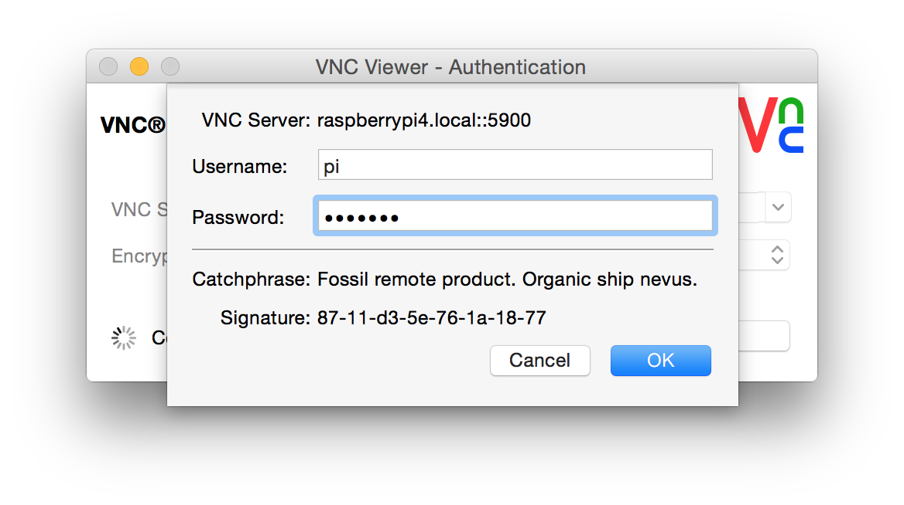
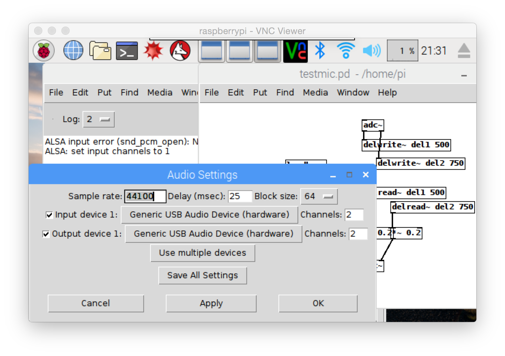
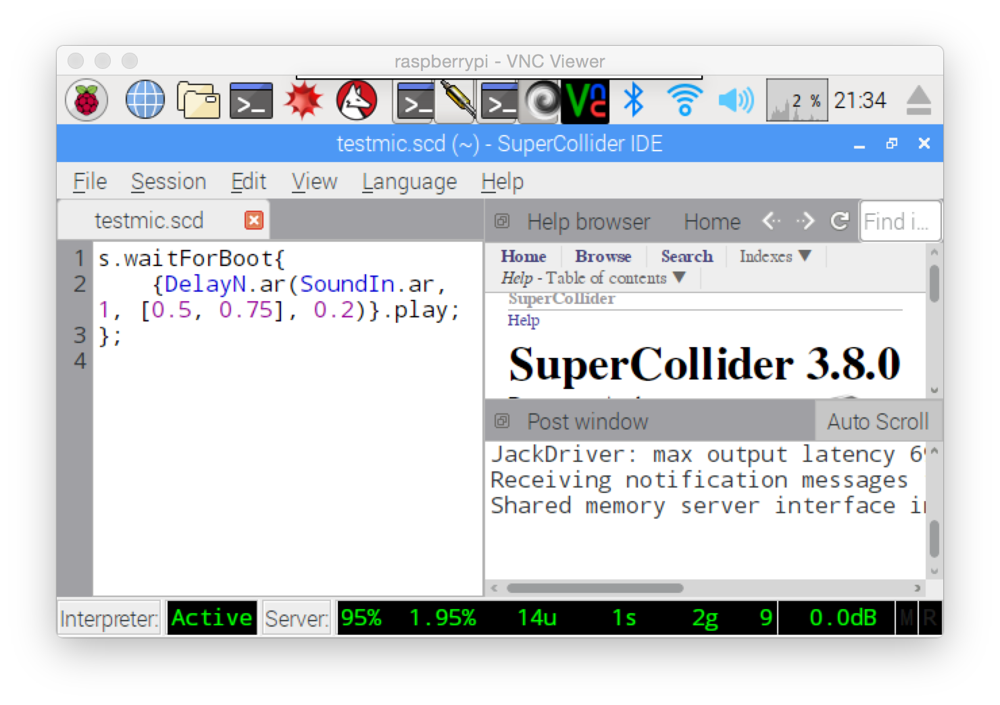

# raspberrypiWorkshop

held at [ems](http://elektronmusikstudion.se) 9oct2016, organized by [vems](https://vems.nu)

in this 3h workshop we will install the raspbian operating system from scratch, install [pure data](http://puredata.info) and [supercollider](http://supercollider.github.io) and last look at how to connect an [arduino](http://arduino.cc) board and send data to/from it and the raspberry pi.

**participants should bring:**

* laptop - preferably with sd card reader/writer
* micro sd card - 8gb or larger
* raspberry pi - model 1b, 2 or 3
* power supply - 5v micro usb for the rpi
* headphones with minijack
* ethernet cable
* arduino with usb cable

**additional:** (_but not necessary_)

* usb sound card
* usb wlan module
* breadboard, sensors, leds, wires

overview
==

these are the steps we will go through. it may look complicated but in practice there are only a few things one need to do. and after you've gone through it once, you should be able to perform it all again in <15min.

details are writting in _italic_.

1. [burn raspbian to your sd card](#burn-raspbian-to-your-sd-card)
2. [start your raspberry pi](#start-your-raspberry-pi)
3. [log in to your raspberry pi](#log-in-to-your-raspberry-pi)
4. [setup raspbian](#setup-raspbian)
5. [setup wifi](#setup wifi)
6. [install pure data](#install-pure-data)
7. [install supercollider](#install-supercollider)
8. [tune your audio](#tune-your-audio)
9. [autostart](#autostart)
10. [communicate with arduino](#communicate-with-arduino)
11. [useful terminal commands](#useful-terminal-commands)
12. [shutdown](#shutdown)

burn raspbian to your sd card
--

1. download the latest [raspbian image](https://www.raspberrypi.org/downloads/raspbian/)
    - _or copy the zip from the provided usbstick_
    - _to save space you can use the .zip file directly without unpacking the .img_
    - _here we use 2016-09-23-raspbian-jessie - **not** the 'lite' version_
    - _jessie 'lite' will fit on a smaller sd card and is useful for non-gui audio-only headless systems_
2. download [etcher.io](http://etcher.io)
    - _works on osx, linux, windows_
    - _on osx you can also use [pifiller](http://ivanx.com/raspberrypi/)_
3. start etcher and select the raspbian zip file
4. insert your 8gb sd card
5. click flash
    - _on my machine the process takes ~9min_
6. if you are using a raspbian image newer than 2016-11-25 make an empty file called 'ssh' on the sd card
    - _for security reasons ssh is no longer enabled by default_


start your raspberry pi
--

1. put the sd card in your raspberry pi
2. connect the ethernet cable to your raspberry pi
    - _the other end goes to your home wlan router or to your laptop_
    - _if you connect to a osx: go to system preferences / network and activate internet sharing - share from wifi to ethernet_
    - _if you connect to a windows machine: see [here](http://raspberrypi.stackexchange.com/questions/11684/how-can-i-connect-my-pi-directly-to-my-pc-and-share-the-internet-connection)_
3. connect 5v micro usb power supply
    - _always connect power last_
    - _and never pull the power without properly shutting down the system (see below)_
    - _on first boot the rpi will automatically expand the file system to make full use of the sd card_

log in to your raspberry pi
--

1. wait a bit after applying 5v
    - _specially on first boot it will take a while to connect to the network_
2. find your raspberry pi on the network and take note of the ip address (e.g. 192.168.1.52)
    - _we want to see that it is accessible and which ip address it got assigned_
    - _to find out you can log in to your router's admin setup panel_
    - _or open terminal and type `arp -a` to list connected devices_
    - _or on osx you can use [lanscan](https://www.iwaxx.com/lanscan)_
3. open a terminal window and type `ssh pi@192.168.1.52` (or whatever ip you found for your rpi)
    - _on osx terminal is found in your applications/utilities folder_
    - _on windows you can install [putty](https://www.raspberrypi.org/documentation/remote-access/ssh/windows.md)_
    - _if you get a warning about 'remote host identification' first do `ssh-keygen -R 192.168.1.52`_
    - _instead of the ip you can also use `ssh pi@raspberrypi` or `pi@raspberrypi.local`_
4. the default password 'raspberry'
5. make sure you can log in like in the picture below
6. then type `exit` to leave


setup raspbian
--

1. log in again using ssh
    - _via terminal or putty - see #3 above_
2. type `sudo raspi-config`
3. select change user password and enter a new password
4. select change hostname under advanced options and enter a new name
    - _this is so that you can identify your raspberry pi on the network_
    - _then use `ssh pi@mynewhostname` to log in_
5. optional: change memory split under advanced options
    - _if you run headless and never use gui you can set this to the lowest (16)_
    - _if you will do graphics (e.g. with openframeworks) set this to a higher value (256)_
6. optional: enable vnc under advanced options
    - _so that you can use the gui remotely with vnc viewer - see under setup wifi below_
    - _install real's [vnc viewer](https://www.realvnc.com/download/viewer/)_
7. finish and reboot


setup wifi
--

1. log again in via ssh
    - _note: use the new hostname (see #4 above) and new password_
2. type `sudo nano /etc/wpa_supplicant/wpa_supplicant.conf`
3. type or copy/paste the following at the bottom

    ```
    network={
        ssid="wifiname"
        psk="password"
    }
    ```
4. press ctrl+o to save and ctrl+x to exit
5. restart with `sudo reboot`
    - _the raspberry pi should now reboot and try to connect to the wifi network - check with lanscan or in your router's setup panel like before_
    - _if the raspberry pi could connect to wifi, you can now disconnect the ethernet cable_
6. optional: start real's vnc viewer and try to connect to your raspberry pi
    - _download it from [here](https://www.realvnc.com/download/viewer/)_
    - _make sure you have activated vnc in raspi-config - see above_





reference: [setting up wifi via command line](https://www.raspberrypi.org/documentation/configuration/wireless/wireless-cli.md)

install pure data
--

first make sure your raspberry is connected to the internet and then do the following.

1. `sudo apt-get update`
2. `sudo apt-get install puredata`
3. `apt-cache search "^pd-"` (this will just list libraries and externals)
4. `sudo apt-get install pd-comport pd-cyclone` (this will install two libraries that we need for arduino below)
5. `nano testsines.pd` and copy/paste in the following

    ```
    #N canvas 1068 88 450 300 10;
    #X obj 238 159 dac~;
    #X obj 235 73 osc~ 400;
    #X obj 289 73 osc~ 404;
    #X msg 126 154 \; pd dsp 1;
    #X obj 126 83 loadbang;
    #X obj 126 123 del 100;
    #X text 42 122 important ->;
    #X obj 238 111 *~ 0.2;
    #X obj 280 111 *~ 0.2;
    #X connect 1 0 7 0;
    #X connect 2 0 8 0;
    #X connect 4 0 5 0;
    #X connect 5 0 3 0;
    #X connect 7 0 0 0;
    #X connect 8 0 0 1;
    ```
6. press ctrl+o to save and ctrl+x to exit
7. `pd -stderr -nogui -verbose -audiodev 4 testsines.pd` (test different audiodev - 4 is usually the usb soundcard)
8. you should hear two sine tones
    - _note: if you are using the build-in headphones output (audiodev 0) you should turn up the volume to 100 with `alsamixer` (see [tune your audio](#tune-your-audio) below)_
9. stop with ctrl+c
10. `nano testmic.pd` and copy/paste the following

    ```
    #N canvas 1068 88 450 300 10;
    #X obj 238 230 dac~;
    #X msg 126 154 \; pd dsp 1;
    #X obj 126 83 loadbang;
    #X obj 126 123 del 100;
    #X text 42 122 important ->;
    #X obj 238 24 adc~;
    #X obj 238 53 delwrite~ del1 500;
    #X obj 238 123 delread~ del1 500;
    #X obj 259 80 delwrite~ del2 750;
    #X obj 280 144 delread~ del2 750;
    #X obj 238 182 *~ 0.2;
    #X obj 280 182 *~ 0.2;
    #X connect 2 0 3 0;
    #X connect 3 0 1 0;
    #X connect 5 0 6 0;
    #X connect 5 1 8 0;
    #X connect 7 0 10 0;
    #X connect 9 0 11 0;
    #X connect 10 0 0 0;
    #X connect 11 0 0 1;
    ```
11. press ctrl+o to save and ctrl+x to exit
12. `pd -stderr -nogui -verbose -audiodev 4 testmic.pd` (test different audiodev - 4 is usually the usb soundcard)
13. if you have a soundcard with a mic connected you should hear an echo effect
    - _note: this example will not make any sound if you try it with the built-in audio - there is no sound input on the raspberry pi_
14. stop with ctrl+c

reference: <http://www.fredrikolofsson.com/f0blog/?q=node/630>

and if you connect a monitor+keyboard or log in via vnc, you can also also patch pd like normal. just start pure data from the menu on the left hand side (under sound & video). set up your audio under 'Media' in the menu bar.



install supercollider
--

just follow the instructions under installation and headless here... <https://github.com/redFrik/supercolliderStandaloneRPI2>

(or if you are using an older rpi1 here <https://github.com/redFrik/supercolliderStandaloneRPI2> )

if you connect a monitor+keyboard or log in via vnc, you can also use the supercollider ide like normal. follow the instructions under startup on the github page linked above.



tune your audio
--

by default the alsa volume on raspberry pi is quite low. it's recommended to turn it up so that you can lower the amplifier on the output and thereby get a less noisy signal.

```bash
alsamixer
```

and to make the settings permanent do...

```bash
amixer controls #and check which numid is ’Master Playback Volume’
amixer cset numid=1 100% #adapt this value
sudo alsactl store
```

autostart
--

to make puredata start the testsines.pd patch at startup do

1. open terminal and type ```crontab -e```
2. scroll down and add the following line (edit to match your audio device and path)

    ```
    @reboot /usr/bin/pd -stderr -nogui -audiodev 4 /home/pi/testsines.pd
    ```
3. press ctrl+o to save and ctrl+x to exit
4. `sudo reboot`

and now you should hear the sines after the rpi booted. to stop log in and type `pkill pd`

to autostart supercollider see the github page linked above.

arduino
--

program an arduino from your laptop with the following

```cpp
//arduino code testarduino.ino
void setup() {
    Serial.begin(57600);
}
void loop() {
    int val = analogRead(A0);
    Serial.write(253);
    Serial.write(254);
    Serial.write(val>>8);
    Serial.write(val&255);
    Serial.write(255);
    delay(100);  //update rate
}
```

and then on the rpi open terminal and type

```bash
apt-cache search "^pd-" #just list libraries and externals
sudo apt-get install pd-comport pd-cyclone #just if you did not do it above
```

then `nano testarduino.pd` and copy/paste the following

```
#N canvas 141 95 450 300 10;
#X msg 86 31 devices;
#X obj 86 61 comport 1 57600;
#X obj 86 95 cyclone/match 253 254 nn nn 255;
#X obj 86 140 unpack f f f f f;
#X obj 140 176 << 8;
#X obj 140 202 +;
#X floatatom 140 230 5 0 0 0 - - -, f 5;
#X connect 0 0 1 0;
#X connect 1 0 2 0;
#X connect 2 0 3 0;
#X connect 3 2 4 0;
#X connect 3 3 5 1;
#X connect 4 0 5 0;
#X connect 5 0 6 0;
```

connect the arduino to the rpi via usb and run the pd patch with

```
pd -stderr -nogui -verbose -audiodev 4 testarduino.pd
```

you should see (and hear) values in the range 0-1023 depending on the voltage present on pin A0. stop with ctrl+c.

for supercollider use this code (testarduino.scd)...

```
(
s.waitForBoot{
   var syn, ser, r;
   syn= {|freq= 0| SinOsc.ar([400, 404]+freq, 0, 0.2)}.play;
   ser= SerialPort("/dev/ttyUSB0", 57600);
   r= Routine.run({
      var val;
      inf.do{
         var data= [];
         var d= 0;
         while({d!=255 and:{d.size<100}}, {
            d= ser.read();
            data= data++d;
         });
         if(data[0]==253 and:{data[1]==254}, {
            val= (data[2]<<8)+data[3];
            syn.set(\freq, val);
            val.postln;
         });
      };
   });
   CmdPeriod.doOnce({ser.close});
};
)
```

and also let's try python. open terminal and type `nano testarduino.py` and paste in the following code

```python
import serial
ser= serial.Serial('/dev/ttyUSB0', 57600)
while True:
    indata= []
    d= ''
    while (d!='\xff') and (len(indata)<100):
        d= ser.read()
        indata.append(d)
    if (indata[0]=='\xfd') and (indata[1]=='\xfe'):
        hibyte= ord(indata[2])
        lobyte= ord(indata[3])
        val= (hibyte<<8)+lobyte
        print val
```

start it with `python testarduino.py` and stop with ctrl+c

shutdown
--

to safely turn off your raspberry pi you need to log in and type:

`sudo halt -p`

then wait for the led on the board to blink 10 times. now you can disconnect the 5v micro usb cable. if you don't power down the system in this way you risk corrupting the sd card.

another option is to add your own button to run a halt script when pressed. below is one way to do this using a python script that always run in the background.

1. log in and type `nano shutdown.py`
2. type or copy/paste the following

    ```python
    import sys
    from os import system
    from time import sleep
    import RPi.GPIO as GPIO
    pinoff= 3
    GPIO.setmode(GPIO.BOARD)
    GPIO.setup(pinoff, GPIO.IN)
    while True:
        if GPIO.input(pinoff)==0:
            system('sudo halt -p')
            sleep(10)
            sleep(0.5)
    ```
3. press ctrl+o to save and ctrl+x to exit
4. type `crontab -e` and add the following to the bottom `@reboot /usr/bin/python /home/pi/shutdown.py`
5. `sudo reboot`, wait for a bit and then connect a cable/button between pin 3 (aka bcm2) and ground. see <https://pinout.xyz>

useful terminal commands
--

```bash
ls              #list files
df -h           #disk free
free -h         #ram memory
top             #cpu usage (quit with 'q')
lsusb           #list usb devices
aplay -l        #list available soundcards
exit            #leave ssh
sudo halt -p    #turn off - wait for 10 blinks
sudo reboot     #restart
sudo pkill pd   #force quit on some program
ls /dev/tty*    #see if /dev/ttyUSB0 is there
```

reference: <https://leanpub.com/jelinux/read>
